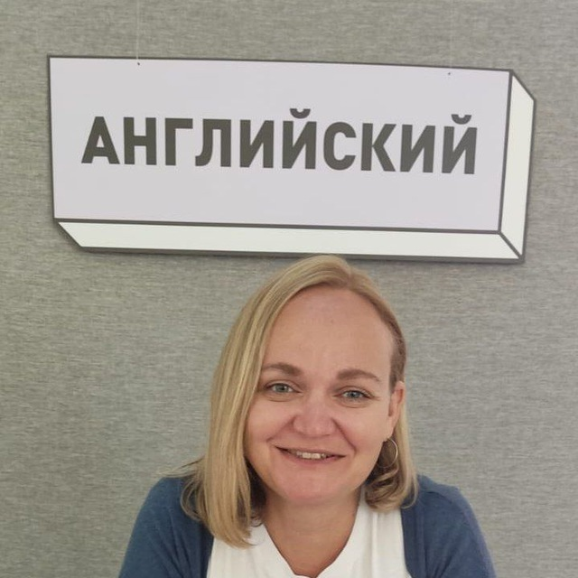

# Julia — English & Russian Teacher
### 📍 Montevideo, Uruguay &nbsp;·&nbsp; 🌐 Online Worldwide

---

## 🇬🇧 English

Individual **English** and **Russian** lessons — online and in person. For adults, expats, and IT professionals.

| What | Details |
|------|---------|
| 🎯 Conversational English | IT interviews, remote work, relocation |
| 🇷🇺 Russian as a Foreign Language | Beginners and intermediate, A1–B2 |
| 💻 Online | Google Meet or Telegram, anywhere in the world |
| 🏙️ Offline | In person in Montevideo, Uruguay |
| 🗣️ Conversation Club | Launching soon — online & in Montevideo |

**What students say:**

> *"I used to understand 60% of English articles and guessed the rest. After 3 months with Julia — I'm at 90%+. Finally stopped being scared of English docs at work."*
> — **Mikhail**, A2→B1

> *"When someone spoke English I just nodded and smiled, understanding nothing. Now I get the meaning and can reply. Julia explains so things click right away."*
> — **Karina**, A1→A2

> *"Was preparing for a technical interview at a foreign company. Julia drilled me through every conversation scenario. Result: got the offer."*
> — **Dima**, B1

📩 **[Book a free trial lesson →](https://juliaenglish.vercel.app/)**

---

## 🇷🇺 Русский

Индивидуальные уроки **английского** и **русского** языка — онлайн и очно. Для взрослых, экспатов и IT-специалистов.

| Что | Подробности |
|-----|-------------|
| 🎯 Разговорный английский | IT-интервью, удалённая работа, релокация |
| 🇷🇺 Русский как иностранный | Начинающие и продолжающие, A1–B2 |
| 💻 Онлайн | Google Meet или Telegram, из любой точки мира |
| 🏙️ Очно | В Монтевидео, Уругвай |
| 🗣️ Разговорный клуб | Скоро старт — онлайн и офлайн |

**Что говорят ученики:**

> *«Читал статьи на английском и понимал 60%, остальное угадывал. После трёх месяцев с Юлей стал понимать 90%+. Наконец перестал бояться английских документов на работе.»*
> — **Михаил**, A2→B1

> *«Раньше когда со мной говорили по-английски я просто кивала и улыбалась, не понимая ни слова. Сейчас улавливаю смысл и могу ответить.»*
> — **Карина**, A1→A2

> *«Готовился к техническому интервью в зарубежную компанию. Юлия гоняла меня по разговорным сценариям. Итог: оффер получил. Рекомендую без оговорок.»*
> — **Дима**, B1

📩 **[Записаться на пробный урок →](https://juliaenglish.vercel.app/)**

---

## 🇪�� Español

Clases individuales de **inglés** y **ruso** — online y presencial. Para adultos, expats y profesionales de IT. Niveles A1–B2.

📩 **[Reservar clase de prueba →](https://juliaenglish.vercel.app/)**

---

## 🇵🇹 Português

Aulas individuais de **inglês** e **russo** — online e presencial. Para adultos, expatriados e profissionais de TI. Níveis A1–B2.

📩 **[Agendar aula experimental →](https://juliaenglish.vercel.app/)**

---

© 2026 Julia Pokonechnykh — English & Russian Teacher, Montevideo, Uruguay

